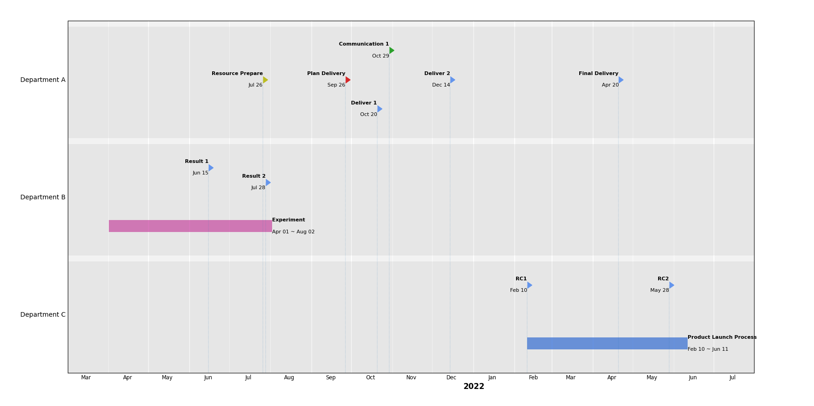

# matplotlib_Timeline
Draw a project planning timeline by matplotlib

Simply provide the milestone and task and their timing in the python code, the timeline
will be created using matplotlib. I am creating this script for project managment. May
or may not do further enhancement based on my working needs.

Using the dataset as the example below:

    dataset = {
            'Department A' : [
                [['Plan Delivery', '2021-9-26'], 'r'],
                [['Communication 1', '2021-10-29'], 'g'],
                [['Resource Prepare', '2021-7-26'], 'y'],
                [['Deliver 1', '2021-10-20']],
                [['Deliver 2', '2021-12-14']],
                [['Final Delivery', '2022-4-20']],
            ],
            'Department B' : [
                [['Experiment', '2021-4-1', '2021-8-2'], 'p'],
                [['Result 1', '2021-6-15']],
                [['Result 2', '2021-7-28']]
            ],
            'Department C' : [
                [['Product Launch Process', '2022-2-10', '2022-6-11']],
                [['RC1', '2022-2-10']],
                [['RC2', '2022-5-28']]
            ]
    }

Various data groups will be provided, each containing milestones and tasks. Each group will be depicted in non overlapping
y spans.

## About the colors
The default item color is set by `defaultColor`. For each milestone or task, you can specify its color separately
| color specifier | Actual Color  |
| ----------------|-------------- |
|       'r'       | 'tab:red'     |
|       'g'       | 'tab:green'   |
|       'b'       | 'tab:blue'    |
|       'y'       | 'tab:olive'   |
|       'p'       | 'tab:pink'    |

## Adding Legend
When multi colors are used, it is useful to create a legend for different color

    myLegend = [
            ['Group 1', 'r'],
            ['Group 2', 'g'],
            ['Group 3', 'p'],
            ['Group 4', 'cornflowerblue'],
    ]

Color legend will gives an extra dimension other than the y span group.

## Screenshot
The generated timeline will be dipicted as below:

